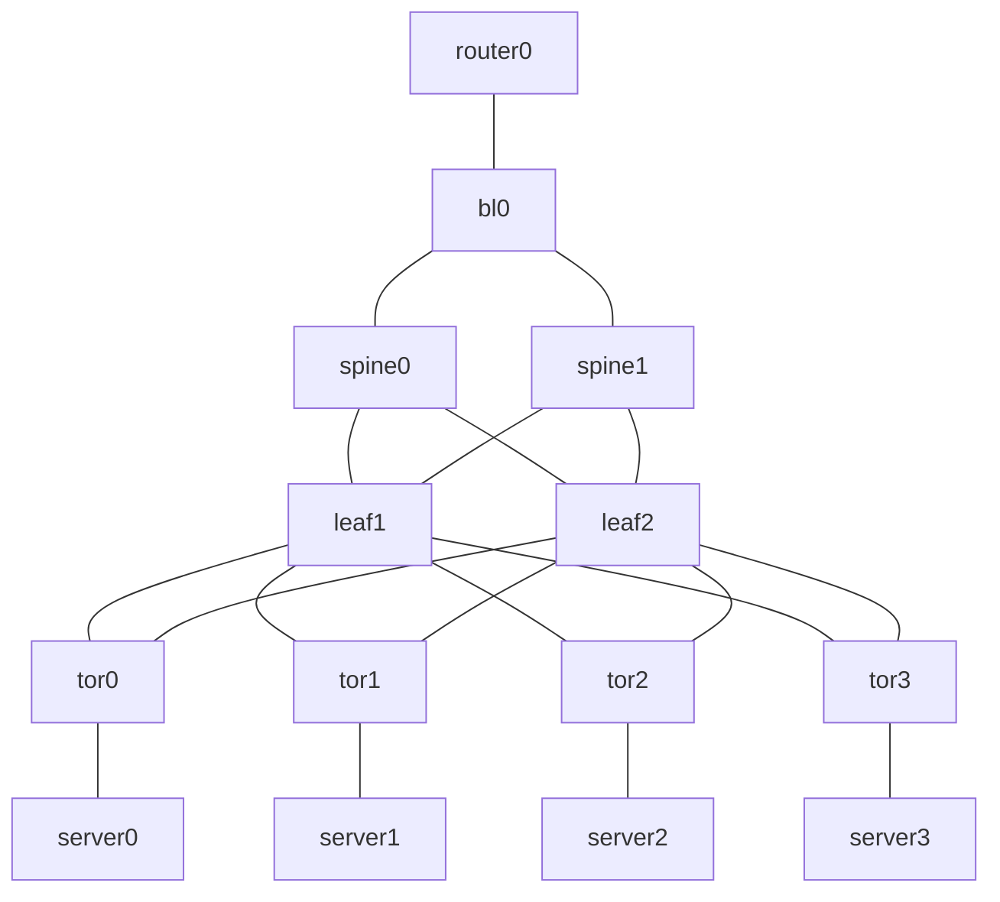

# clos-tinet

A tool to generate Clos network topology for [tinet](https://github.com/tinynetwork/tinet).

Build an L3 fabric with BGP Unnumbered using BIRD2.

## Features

- RFC 7938 compliant BGP design
- BGP Unnumbered (IPv6 link-local address)
- BFD for fast failure detection
- Graceful Restart
- Per-layer prefix filters
- Anycast address (10.100.0.1/32)
- Customizable BIRD templates

## Prerequisites

- [tinet](https://github.com/tinynetwork/tinet)
- Docker

## Installation

```bash
$ go build
```

## Usage

### Basic

Generate spec.yaml and BIRD configuration files

```bash
$ ./clos-tinet > spec.yaml
```

Copy BIRD configurations to tinet volume

```bash
$ cp ./output/*.conf /tmp/tinet/
```

Start topology

```bash
$ tinet up -c spec.yaml | grep -v '<->' | sudo sh -x
$ tinet conf -c spec.yaml | sudo sh -x
```

### Large-scale topology

```bash
./clos-tinet \
    -spines 8 \
    -leaf-pairs 100 \
    -tors-per-pair 4 \
    -servers-per-tor 48 > spec.yaml
```

### Stop topology

```bash
$ tinet down -c spec.yaml | sudo sh -x
```

## Options

| Option             | Default          | Description                                   |
|--------------------|------------------|-----------------------------------------------|
| `-spines`          | 2                | Number of spine switches                      |
| `-leaf-pairs`      | 1                | Number of leaf switch pairs                   |
| `-tors-per-pair`   | 2                | Number of ToR switches per leaf pair          |
| `-servers-per-tor` | 2                | Number of servers per ToR                     |
| `-border-leaves`   | 1                | Number of border leaf switches                |
| `-routers`         | 1                | Number of external routers                    |
| `-bird-config-dir` | `./output`       | Output directory for BIRD configuration files |
| `-bird-templates`  | `templates.yaml` | Path to BIRD templates file                   |

## Verification

```bash
# Check BGP sessions
sudo docker exec spine0 birdc show protocols

# Check routes
sudo docker exec spine0 birdc show route

# End-to-end connectivity test
sudo docker exec router0 ping -c 3 10.100.0.1

# traceroute
sudo docker exec router0 traceroute -n 10.100.0.1
```

## Default Topology



## Customizing Templates

Edit `templates.yaml` to customize BIRD configurations.

Available template variables:

| Variable                          | Description              |
|-----------------------------------|--------------------------|
| `{{ .RouterID }}`                 | Router ID                |
| `{{ .ASN }}`                      | Local AS number          |
| `{{ .Neighbors }}`                | List of BGP neighbors    |
| `{{ .Neighbors[].Name }}`         | Neighbor protocol name   |
| `{{ .Neighbors[].Interface }}`    | Interface name           |
| `{{ .Neighbors[].PeerASN }}`      | Peer AS number           |
| `{{ .Neighbors[].PeerLLA }}`      | Peer link-local address  |
| `{{ .Neighbors[].LocalLLA }}`     | Local link-local address |
| `{{ .Neighbors[].ImportFilter }}` | Import filter name       |
| `{{ .Neighbors[].ExportFilter }}` | Export filter name       |
| `{{ .Neighbors[].MaxPrefix }}`    | Maximum prefix limit     |

## Documentation

- [Design Document](./DESIGN.md) - Topology design and BGP Unnumbered implementation details

## References

- [RFC 7938 - Use of BGP for Routing in Large-Scale Data Centers](https://datatracker.ietf.org/doc/html/rfc7938)
- [RFC 5549 - Advertising IPv4 Network Layer Reachability Information with an IPv6 Next Hop](https://datatracker.ietf.org/doc/html/rfc5549)
- [BIRD Internet Routing Daemon](https://bird.network.cz/)
- [tinet](https://github.com/tinynetwork/tinet)

## License

This project is licensed under the [MIT License](./LICENSE).
